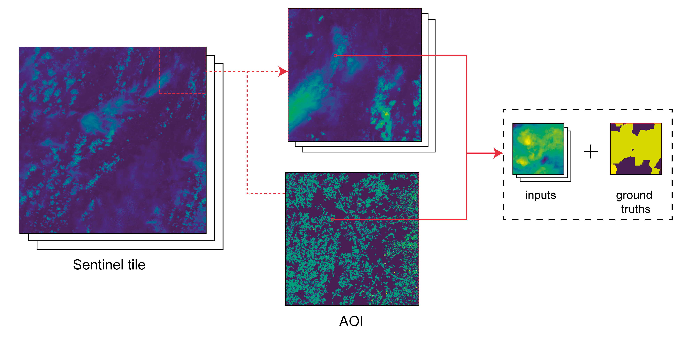

# DeepSatData: make datasets of Sentinel images for training machine learning models

DeepSatData is a toolkit for making datasets from satellite imagery suitable for training machine learning models. 
The process is split into two distinct parts:
- identifying and downloading relevant Sentinel products for an area and time period of interest. Read more in  [download](./download)
- processing downloaded products into datasets. Read more in [dataset](./dataset). 
 
Further details on the methodology used can be found in our papers 
["Context-Self similarity pretraining from crop type segmentation from satellite images"](arxiv url) and 
["Extracting large scale datasets of Sentinel satellite image timeseries for training machine learning models"](arxiv url). 

## Citation
If you use DeepSatData in your research please use the following BibTeX entries:

## License
This project is under the CC-BY-NC 4.0 license. See [LICENSE](LICENSE) for details.

## Related projects
This code was used in creating datasets used in [github repo name](github repo url)